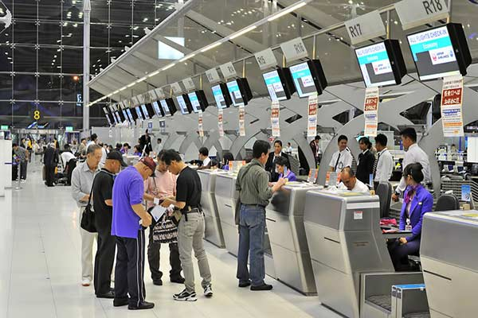
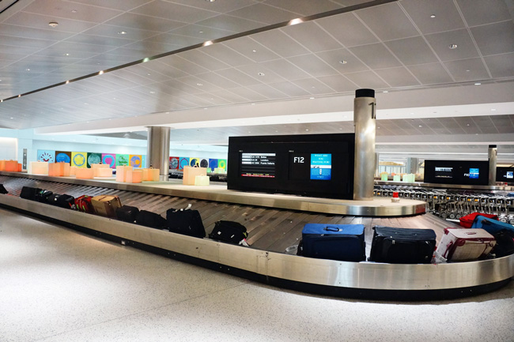
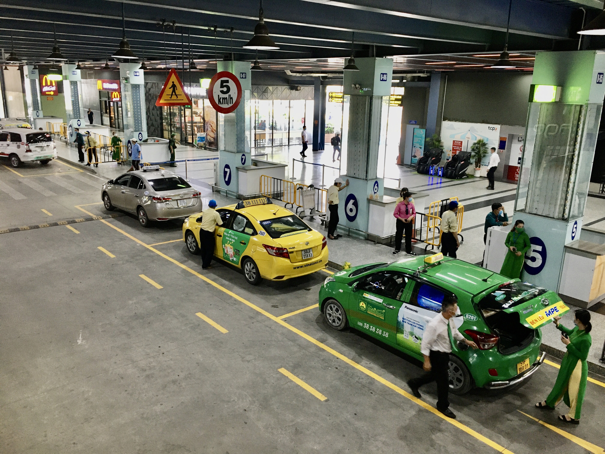
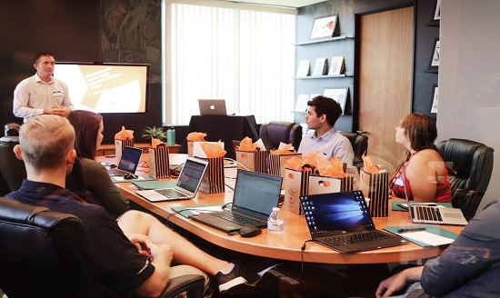

# **<h5 style="color:orange;">** ĐI CÔNG TÁC

## **<h5 style="color:chocolate;"> 1. Tại sân bay</h5>** <!--StartFragment-->

<!--EndFragment-->

 ✨ Xin chào, anh cho xem hộ chiếu và visa

Vâng, tôi gửi hộ chiếu

 ✨ Anh đến Việt Nam để làm gì?

Tôi đến Việt Nam để đi công tác

 ✨ Anh làm việc tại công ty nào và lưu trú tại Việt Nam bao lâu

Dạ, tôi làm việc tại công ty ABC và sẽ ở đây công tác 10 ngày

 ✨ Cảm ơn anh, mời anh mở khẩu trang và nhìn vào camera

Dạ. 

 ✨ Được rồi, tôi gửi lại hộ chiếu

Cảm ơn anh

## **<h5 style="color:green;">2. Tại khu vực hành lý</h5>**

<!--StartFragment-->

<!--EndFragment-->

 ✔️ Chào chị, tôi bị lạc hành lý. 

Dạ anh cho xin mã chuyên bay và tên, chúng tôi sẽ hỗ trợ anh

 ✔️ Tôi gửi. Mã chuyến bay AJB 12345, tôi tên là Vũ Nguyễn Hưng

Cảm ơn thông tin của anh, vui lòng chờ một lát

 ✔️ Vâng

Chào anh, chúng tôi đã tìm thấy hành lý của anh rồi. Mời anh sang bên này nhận hành lý

 ✔️ Vâng, cảm ơn các chị nhiều

## **<h5 style="color:RED;"> 3. Tại khu vực chờ taxi</h5>** <!--StartFragment-->

<!--EndFragment-->

 ✴️ Chào anh, anh có cần taxi không?

Có, tôi chỉ có 1 mình

 ✴️ Vâng, mời anh lên xe này

Anh muốn đi đâu ạ?

Cho tôi đi công ty ABC tại quận 4

 ✴️ Vâng. Của anh là 255.000 đồng ạ. 

Tôi gửi tiền, anh lấy giúp hành lý sau cốp xe giúp tôi.

## **<h5 style="color:ORANGE;">4. Tại công ty</h5>**

<!--StartFragment-->

<!--EndFragment-->

 🟢 Xin chào, tôi là Hsung. Nhân viên kinh doanh và sẽ làm việc tại văn phòng của chúng ta từ thứ 2 tuần này đến chủ nhật. Rất mong mọi người hỗ trợ

Chào mừng anh đến. Nếu anh cần hỗ trợ gì thì cứ nói với chúng tôi. 

Xin giới thiệu với anh, đây là bộ phận kế toán, đây là bộ phận kinh doanh, đây là bộ phận nhân sự, còn kia là bộ phận chăm sóc khách hàng. 

 🟢 Chào mọi người, hôm nay chúng ta có cuộc họp phải không?

Đúng rồi, chiều nay lúc 2 giờ. Anh hãy tham gia tại phòng họp B nhé

 🟢 Vâng. Hẹn gặp mọi người chiều nay

## **<h5 style="color:BLUE;">5. Trong cuộc họp</h5>**

<!--StartFragment-->

<!--EndFragment-->

 🧷 Chào tất cả mọi người, hôm nay chúng ta sẽ họp về chiến lược kinh doanh cho quý II

Đầu tiên, tôi là Hsung, phụ trách bộ phận kinh doanh tại USA và sẽ công tác tại Việt Nam 1 tuần. 

Anh có ý kiến gì cho việc kinh doanh quý II không?

 🧷 Theo tôi, chúng ta sẽ đẩy mạnh bán sản phẩm C cho khách hàng tại các khu công nghiệp

Tôi đồng ý với ý kiến của anh. Mời các bộ phận khác cho ý kiến.

## **<h5 style="color:Brown;"> 6. Tại buổi ăn cơm công ty</h5>**

<!--StartFragment-->

<!--EndFragment-->

Đây là món ăn đặc sản của Việt Nam - phở

 🥗 Vâng, đây cũng là lần đầu tiên tôi được ăn phở, thực sự rất ngon

Đầu bếp của công ty nấu phở rất ngon, giống như ở nhà hàng  ^ ^

Tối nay anh có kế hoạch gì không?

 🥗 Tôi không, mọi người có muốn đi ăn tối cùng nhau không?

Được. Chúng ta đi ăn món ăn Việt nhé. Gần đây có nhà hàng rất nổi tiếng với món Việt.

 🥗 Vậy à, mấy giờ chúng ta gặp nhau?

Sau khi tan làm sẽ đi luôn. Có thể đi bộ. 

<!--StartFragment-->

<!--EndFragment-->

*Nhắn tin cho cô nếu bạn có bất cứ câu hỏi nào!*

LINE: **hoangthigam**