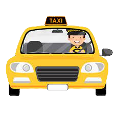
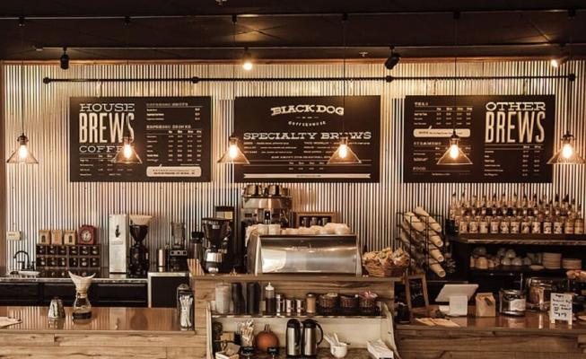
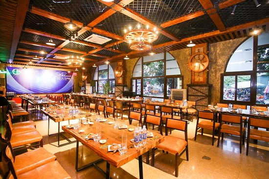



 

##### **<h5 style="color:chocolate;">1. Chào hỏi</h5>**

<h6>Xin chào, tôi tên là Emma</h6>

Bạn/ Anh/ Chị tên là gì ? 

* Chào anh, anh tên là gì?

Tôi tên là Nam, còn chị?

* Tôi tên là Lan. Anh khỏe không?

Tôi bình thường, rất vui được gặp chị.

 

 

 ✧ &nbsp Xin lỗi, đây có phải là khách sạn ABC không? 

Đúng rồi ạ. Mời anh vào.

 ✧ &nbsp Xin chào chị Lan, chị có khỏe không? 

Cảm ơn em, chị khỏe. Còn em?

 ✧ &nbsp Em hơi mệt ạ. Hôm qua em làm đêm. /p>

Em đã ăn cơm chưa?

  ✧ &nbsp Dạ chưa, bây giờ em sẽ đi ăn ạ. 

 

##### <h5 style="color:lime;">2. Số</h5>

1. Một
2. Hai
3. Ba
4. Bốn
5. Năm
6. Sáu
7. Bảy
8. Tám
9. Chín
10. Mười

1000: Một nghìn

1 000 000: Một triệu

1 000 000 000: Một tỷ 

 

##### <h5 style="color:orange;">3. Bao nhiêu tiền</h5>

 ✧ &nbsp  Xin chào, 1 bát phở bao nhiêu tiền? 

Phở gà 50.000 vnd thôi, phở bò 65.000 vnd ạ.

 ✧ &nbsp Chào em, bao nhiêu tiền một cái bánh mì? 

20.000 đồng ạ, anh muốn bánh mì gì?

 ✧ &nbsp Cho anh một cái thịt nướng nhé. 

 

##### <h5 style="color:red;">4. Đi đường</h5>

<h5 style="color: chocolate;">Rẽ phải</h5>      

<h5 style="color: chocolate;">Rẽ trái</h5>            

<h5 style="color: chocolate;">Đi thẳng</h5>                 

 

✧   Chị ơi, đi quán cà phê BEN đi thế nào?

Em đi thẳng khoảng 50 mét rồi rẽ phải nhé. Quán cà phê ở bên trái đường.

✧   Từ đây đến Đà Nẵng có thể đi xe buýt không?

Có thể, nhưng xa lắm. Anh nên đi máy bay.

✧   Máy bay cũng rẻ, khoảng 1.000.000vnd thôi.

Vậy à, tôi có thể mua vé máy bay ở đâu?

✧   Anh có thể mua online hoặc đến quầy bán vé gần đây.

Cảm ơn em!

 

✧   Chị ơi, cho hỏi, tôi có thể đi bộ đến trung tâm thương mại (Shopping mall) không?

Anh chỉ cần đi thẳng đến ngã tư đầu tiên rồi rẽ trái là đến. 

✧   Thế à, rất gần nhỉ. Cảm ơn chị nhiều nhé!

 

 

✧   Chào anh, mời anh lên xe. Anh muốn đi đâu ạ?

Xin chào, tôi muốn đi siêu thị G.

✧   Dạ, anh đến Việt Nam lâu chưa?

Cũng 2 tháng rồi ạ, tôi rất thích món ăn Việt Nam.

✧   Vậy à, anh thích món nào nhất ?

Tôi thích bún chả nhất.

✧   Thế à? ở gần đây có quán bún chả rất nổi tiếng.

Cảm ơn anh, lát nữa tôi sẽ ghé ăn. 

 

✅   Xin chào, cho tôi đi khách sạn Novotel. Từ đây, đi thẳng khoảng 500 mét, sau đó rẽ trái. 

Vâng, của chị là 200.000VND.

✅   Cảm ơn, tiền xe đây ạ.

 

##### <h5 style="color:lime;">5. Quán cà phê</h5>

 

✧   Cho tôi hỏi 1 cốc cà phê bao nhiêu tiền?

Chị muốn loại nào?

✧   Cho tôi cà phê sữa, có đá nhé.

Vâng, của chị là 55.000vnd

✧   Có thể thanh toán bằng thẻ không?

Có thể ạ!

 

✧   Chào chị, chị muốn dùng gì ạ?

Cho chị một nước ép táo nhé, không đường và ít đá thôi.

✧   Dạ, của chị 60.000vnd ạ.

Đây, chị gửi tiền.

 

✧   Chị ơi, chị có biết nhà hàng Chú Tư ở đâu không ạ?

À, nhà hàng đó rất gần. Từ đây anh đi thẳng 300 mét đến ngã tư, sau đó anh rẽ phải và đi tiếp. Nhà hàng đó ở bên phải anh nhé.

✧   Ồ, cảm ơn chị nhiều. 

Không có gì. 

 

##### <h5 style="color:green;">6. Ở khách sạn</h5>

 

✧   Xin chào, tôi có đặt phòng ở đây.

Xin chào anh, anh cho xin mã đặt phòng ạ!

✧   Vâng, 2390345, tôi đặt qua Agoda, tên tôi là Tom.

Dạ. Khách sạn đã nhận được đặt phòng của anh. Anh cho xin hộ chiếu ạ!

✧   Hộ chiếu của tôi đây. 

Mời anh ngồi chờ một lát. 

✧   Cảm ơn!

 

✧   Xin hỏi, ở đây có cho thuê xe máy không?

Có ạ, thuê xe máy 1 ngày 200.000vnd ạ.

✧   Vậy cho tôi thuê 1 chiếc nhé, tôi cần bây giờ.

Vâng, em gửi chìa khóa xe.

 

✧   Chào chị, tôi trả phòng.

Dạ, anh cho xin chìa khóa phòng. Anh vui lòng chờ một lát, chúng tôi đang kiểm tra phòng. 

✧   Của anh dùng 1 chai bia và 1 chai nước suối, tổng là 100.000 vnd.

Đúng rồi, anh thanh toán bằng thẻ nhé.

✧   Dạ, cảm ơn anh. Hẹn gặp lại anh lần sau ạ.

 

##### <h5 style="color:cornflowerblue;">7. Ở nhà hàng</h5>

 

✧   Xin chào quý khách, anh chị có bao nhiêu người ạ?

2 người, tôi cần bàn có view sông. 

✧   Vâng ạ, mời anh chị đi lối này. Em gửi thực đơn ạ.

Cho tôi 1 lẩu hải sản và 2 chai bia Saigon. 

✧   Vâng ạ!

 

✧   Chào em, ở đây có món gì đặc biệt?

Dạ tôm hấp sả cực kỳ ngon ạ.

✧   Vậy à, cho anh 1 ký nhé và cho anh thêm vài lon bia.

Ngoài ra, thêm 1 phần thịt nướng và mì xào.

✧   Dạ.

 

✧   Em ơi, tính tiền.

Dạ, của anh chị là 650.000vnd ạ. 

✧   Chị thanh toán bằng thẻ nhé!

 

**<h6>Một số câu hay dùng khi đi nhậu</h6>**

✧   Không say không về

✧   1 ,2, 3 dô

✧   Trăm phần trăm (100%)

✧   Cạn ly

 

 

*Nhắn tin cho cô nếu bạn có bất cứ câu hỏi nào!*

**Course:** https://www.udemy.com/user/hoang-thi-gam-2/

**Youtube:** @VietnameseTeachers

**Contact LINE:** hoangthigam

 