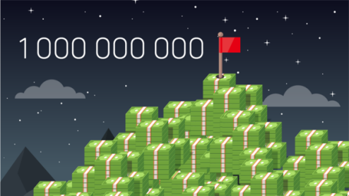
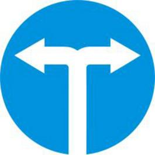

##### **1.   Chào hỏi**

###### **Xin chào, tôi tên là Emma**

Bạn/ Anh/ Chị tên là gì ? 

* Chào anh, anh tên là gì?

Tôi tên là Nam, còn chị?

* Tôi tên là Lan. Anh khỏe không?

Tôi bình thường, rất vui được gặp chị.

   ✧   Xin lỗi, đây có phải là khách sạn ABC không ?

Đúng rồi ạ. Mời anh vào.

   ✧   Xin chào chị Lan, chị có khỏe không?

Cảm ơn em, chị khỏe. Còn em?

   ✧   Em hơi mệt ạ. Hôm qua em làm đêm.

Em đã ăn cơm chưa?

   ✧  Dạ chưa, bây giờ em sẽ đi ăn ạ.

 

##### 2.   Số

1. Một
2. Hai
3. Ba
4. Bốn
5. Năm
6. Sáu
7. Bảy
8. Tám
9. Chín
10. Mười

1000: Một nghìn

1 000 000: Một triệu

1 000 000 000: Một tỷ 

 

##### 3.   Bao nhiêu tiền

✧   Xin chào, 1 bát phở bao nhiêu tiền?

Phở gà 50.000vnd thôi, phở bò 65.000vnd ạ

✧   Chào em, bao nhiêu tiền một cái bánh mì?

20.000 đồng ạ, anh muốn bánh mì gì?

✧   Cho anh một cái thịt nướng nhé. 

 

##### 4.   Đi đường

I am red

**Rẽ phải** {style="color: red"}

**Rẽ trái** {style="color: red"}

**Đi thẳng** {style="color: red"}

✧   Chị ơi, đi quán cà phê BEN đi thế nào?

Em đi thẳng khoảng 50 mét rồi sẽ phải nhé. Quán cà phê ở bên trái đường.

✧   Từ đây đến Đà Nẵng có thể đi xe buýt không?

Có thể, nhưng xa lắm. Anh nên đi máy bay.

✧   Máy bay cũng rẻ, khoảng 1.000.000vnd thôi.

Vậy à, tôi có thể mua vé máy bay ở đâu?

✧   Anh có thể mua online hoặc đến quầy bán vé gần đây.

Cảm ơn em!