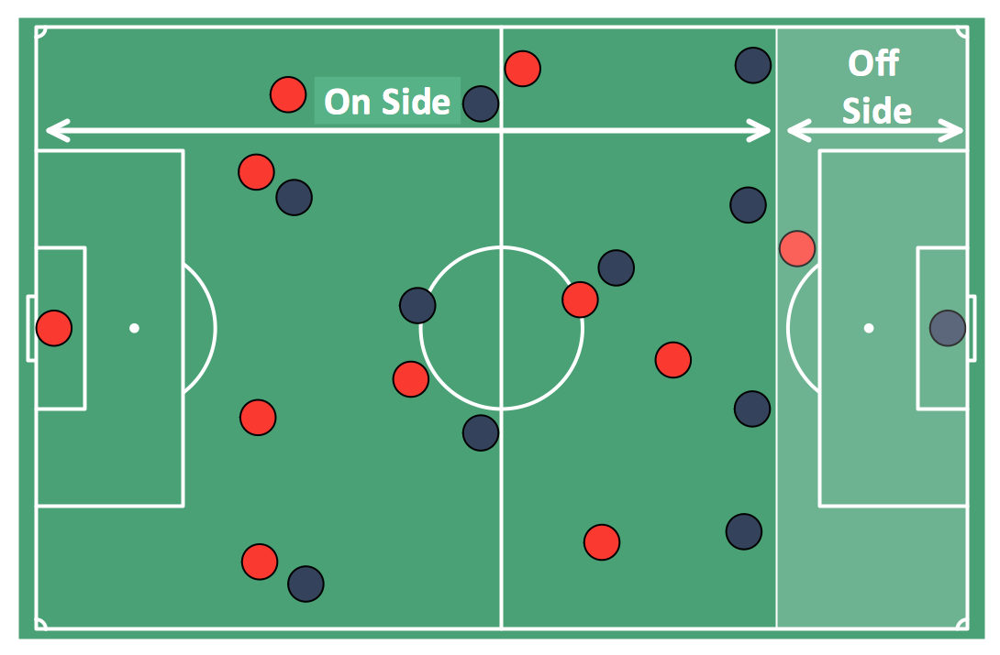

Câu 1: Bàn thắng không được công nhận, vì trọng tài cho rằng một cầu thủ đã phạm lỗi.....

A. Liệt vị

B. Việt vị

C. Định vị

D. Thiên vị

Câu 2: Thử thách lớn nhất trong cuộc đời thường không xảy ra trong ... mà là sau khi đạt được thành công. 

A. Nghịch lý

B. Nghịch tặc

C. Nghịch cảnh

D. Nghịch ngợm

Câu 3: .... biết con đường phía trước còn nhiều chông gai, nhưng tôi sẽ không bỏ cuộc.

A. Chỉ

B. Nếu

C. Dẫu

D. Còn

Đáp án

Câu 1: B

Câu 2: C

Câu 3: C

**Nhắn tin cho cô nếu bạn có bất cứ câu hỏi nào!**

LINE: hoangthigam