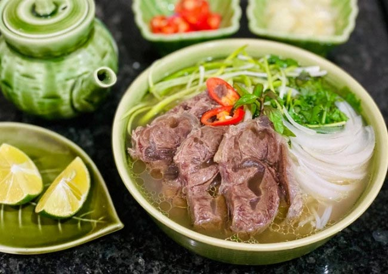
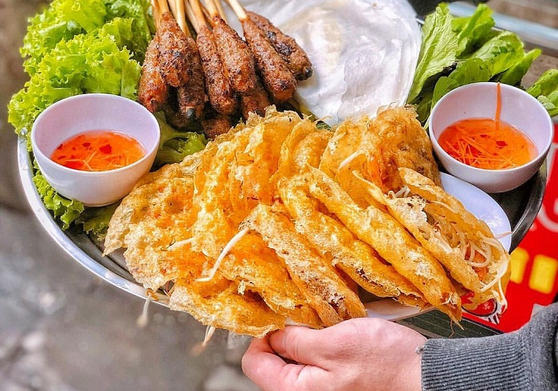
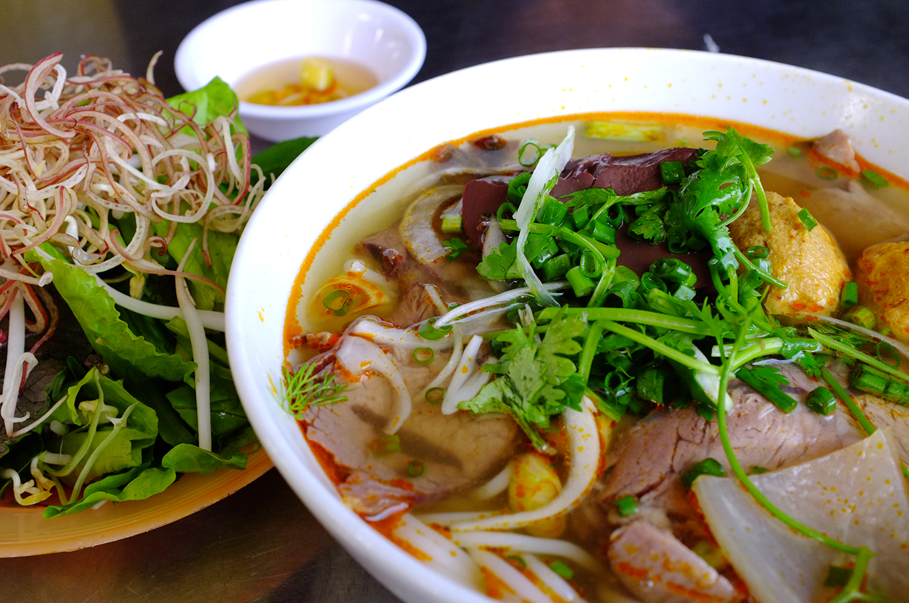
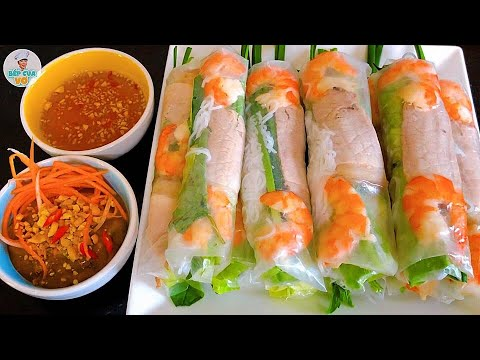
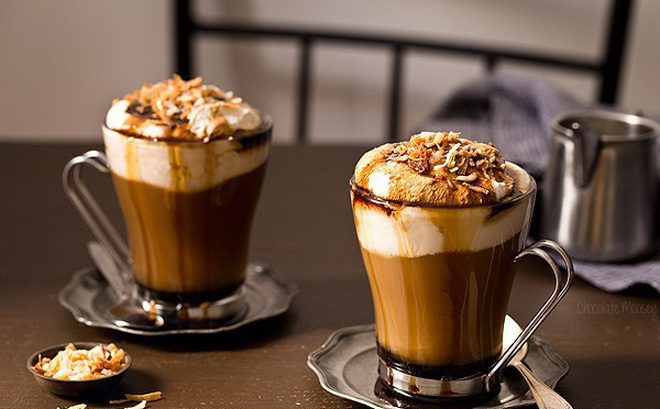
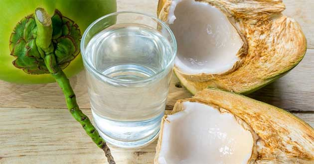
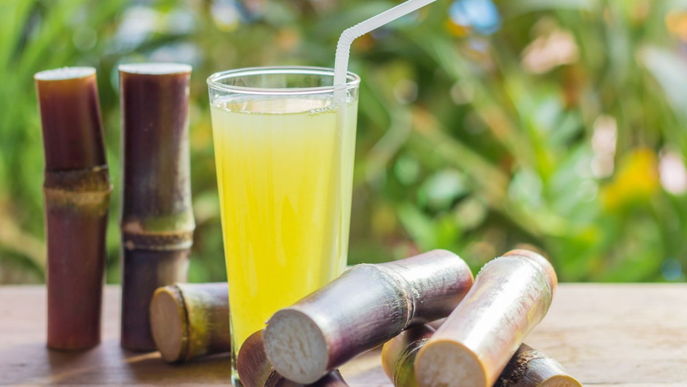

###### 10 CONVERSATIONS - HÔM NAY ĂN UỐNG GÌ?

##### **<h5 style="color:chocolate;">** I. ĂN GÌ?

Đi du lịch mà không biết ăn gì... Xem dưới đây nhé

<h5 style="color:red;"> CONVERSATIONS

<h5 style="color:blaclk;">1. Phở

*Phở bò, phở gà,...*

**
 ✧ Chị ơi, cho em 1 phở gà không hành (spring onion) và 1 phở bò đầy đủ
**

**Chờ một lát nhé, vào bàn ngồi đi**

**
 ✧ Dạ. Chị bán phở mấy năm rồi
**

15 năm rồi. Chị gửi 2 bát phở nhé

 ✧ Dạ, cảm ơn chị nhiều. Chị ơi, ngon quá. Em gửi tiền

 Của em tổng là 120.000 đồng

### <h5 style="color:lime;">2. Bánh xèo + Nem lụi</h5>

*Bánh xèo hải sản, bánh xèo tôm thịt* 

 ✧ Mời vào, em ăn bánh xèo gì?
 
Cho em 1 bánh xèo hải sản và 3 cây nem lụi

 ✧ Em có ăn được rau không?
 
Dạ được, nhiều rau giúp em ạ

 ✧ Chị gửi thức ăn nhé!
 

 ✧ Có 1 cây nem lụi em trả lại phải không? 
 
Dạ, em không ăn hết, nhiều quá. Trả lại được không chị?

 ✧ Được em, của em 1 dĩa và 2 cây, tổng 90.000 đồng. 
 
Cảm ơn chị. 

 ✧ Lần sau lại ghé tiếp nhé

**<h5 style="color:orange;"> 3. Bánh mì</h5>**

*Bánh mì thập cẩm, bánh mì thịt nướng, bánh mì trứng, bánh mì sữa*

 ✧ Cô ơi, cho con 1 ổ bánh mì thập cẩm không ớt trái

Con ăn tương ớt không?

 ✧ Dạ có, một chút thôi ạ

Còn lại đầy đủ hết phải không ?

 ✧ Dạ cô. 

Chờ cô nướng lại một lát cho ngon

 ✧ Dạ, con gửi tiền ạ

**<h5 style="color:blue;">  4.Bún</h5>**
*Bún chả, Bún bò Huế, Bún chả cá,...*

 ✧ Con ăn gì?

Cho con 1 phần bún chả nhiều ớt và 1 cốc sữa đậu nành. Cho con thêm bún nhé

 ✧ Rồi, con ngồi chờ cô lát

Cô ơi, cô có bán ăn sáng không?

 ✧ Có, cô bán cả ngày. Sáng, trưa, tối đều có nhé

Vâng, vậy thì lần sau con sẽ sang ăn sáng nữa. Quán cô rất gần chỗ con ở.

 ✧ Vậy thì tốt quá!

**<h5 style="color:olive;">5. Gỏi cuốn tôm thịt</h5>**

 ✧ Chào con, mời vào

Cho con 2 phần gỏi cuốn tôm thịt và 1 phần gỏi cuốn trứng tôm

 ✧ Nước chấm cay không con ?

Dạ cay cô ạ. nhiều ớt giúp con ạ

**<h5 style="color:teal;"> II. UỐNG GÌ?</h5>**

**<h5 style="color:brown;"> 1. Cà phê</h5>**
*Cà phê sữa đá, cà phê dừa, cà phê muối, cà phê trứng, cà phê đen...*

 ✧ Ở đâu bán cà phê trứng nhỉ?

Ngay ngã tư, quán tên COFFEE ĐẬM

 ✧ Em ơi, cho anh 1 ly cà phê trứng nhé

Dạ vâng, anh thanh toán bằng tiền mặt hay thẻ ạ

 ✧ Thẻ nhé, anh gửi. 

Dạ cảm ơm anh, em gửi anh số gọi món, khi thẻ này rung thì anh đến quầy lấy món giúp em

 ✧ Ừ, anh biết rồi. Cảm ơn em!

<h5 style="color:gold;">2. Nước dừa</h5>

 ✧ Cô ơi, cho con 1 quả dừa xiêm mang về

Cô gửi nhé, có lấy ống hút không?

 ✧ Dạ có ạ, con gửi cô tiền

Cảm ơn con, lần sau ghé nữa nhé

 ✧ Chắc chắc rồi ạ

<h5 style="color:brown;">3.Nước mía</h5>

 ✧ Cho anh 2 cốc nước mía ít đá.

Dạ, anh có ăn thêm đồ ăn vặt không?

 ✧ Em có món gì?

Em có xúc xích chiên, bánh tráng trộn, ốc hút và bánh mì thịt ạ

 ✧ Vậy à, cho anh 1 dĩa ốc hút và 1 bánh mì thịt

Dạ vâng.
<h5 style="color:teal;">III. Nhậu gì?</h5>

**<h5 style="color:orange;">1. Lẩu hải sản</h5>**

 ✧ Mời anh chị ngồi, em gửi thực đơn
Ở quán nhậu của em, có món gì đặc biệt?

 ✧ Dạ, lẩu hải sản của quán em rất ngon ạ, nhiều khách quay lại nhiều lần vì món này

Thế à, vậy cho anh 1 lẩu hải sản và 1 bánh cuốn tôm thịt

 ✧ Dạ, anh dùng nước gì ạ?

Lấy cho anh 1 thùng bia Saigon nhé, bia lạnh nhé

 ✧ Dạ vâng ạ!

**<h5 style="color:brown;">2. Hải sản</h5>**

 ✧ Cho anh gọi thêm món. 1 dĩa mực hấp và 1 dĩa tôm nướng nhé. Lấy thêm vài chai bia nữa, ra món nhanh nhanh nhé

Dạ vâng, anh chờ em một lát ạ. Anh có cần thêm rau không ạ

 ✧ Thôi, đủ rồi em. Rồi tính tiền luôn giúp anh

Dạ em gửi anh bill ạ, anh kiểm tra giúp em đúng món chưa ạ

 ✧ Đúng rồi nhé, anh gửi tiền

Dạ em cảm ơn ạ!

**Nhắn tin cho cô nếu bạn có bất cứ câu hỏi nào!**

**LINE: hoangthigam**