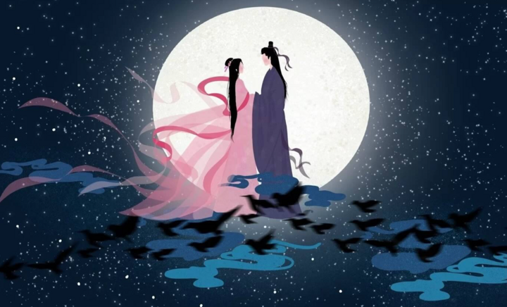
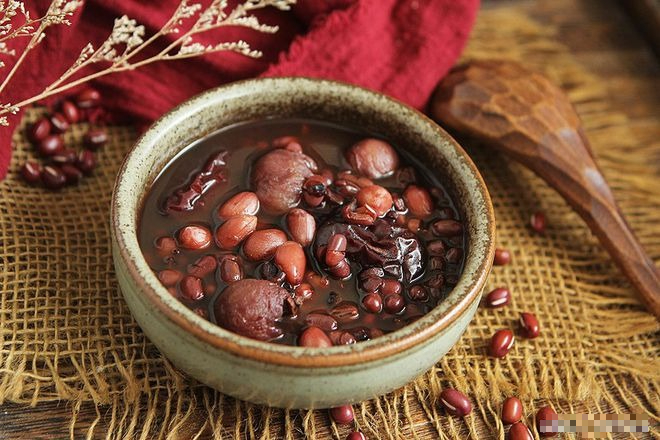

Ngày lễ Thất Tịch ở Việt Nam hay được gọi là "ngày ông Ngâu bà Ngâu". Gọi là như vậy vì trong ngày này thường có mưa ngâu.

越南的**七夕节**通常被称为“Ông Ngâu Bà Ngâu”。因这一天经常下 "Mưa Ngâu" 雨而得名。

Tương truyền, mưa là giọt nước mắt của Ngưu Lang và Chức Nữ khi họ gặp nhau.

传说，这雨是 **牛郎織女**相遇时的眼泪。

Người ta tin rằng nếu hai người yêu nhau cùng đi ngắm sao Ngưu Lang Chức Nữ vào đêm 7/7 sẽ mãi mãi bên nhau. 

人们相信，如果两个相爱的人在7月7日晚上去看明星**牛郎織女**，他们就会永远在一起。 

 

 

## **Tại sao nên ăn chè đậu đỏ vào ngày Thất tịch?**

那天为什么要吃红豆汤？

Theo quan niệm cổ xưa của nhiều dân tộc phương Đông, đậu đỏ mang lại may mắn vì màu đỏ tượng trưng cho sự tốt lành và phát triển. 

根据许多东方民族的古老信仰，红豆带来好运，因为红色象征着善良和发展。

Tương truyền, những người ăn đậu đỏ vào ngày Thất Tịch sẽ nhanh chóng tìm được người yêu khi còn độc thân và bên nhau trọn đời khi kết hôn.

传说，在“七夕”吃红豆的人，单身时会很快找到情人，结婚后会永远在一起。

 

 