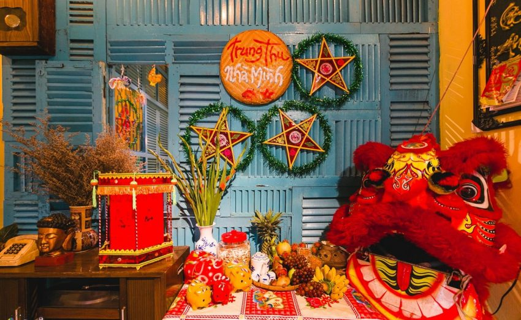

**TẾT TRUNG THU - NGÀY 15 THÁNG 8 ÂM LỊCH** 

## **Từ Vựng** 

**Tết Trung Thu: 中秋节**               

**Bánh Trung Thu: 月饼**

**Tổ tiên: 祖先**                    

**Hoạt động vui chơi: 有趣的活动**

**Truyền thống: 传统**                

**Phong tục: 习俗**

 

 

**Tết Trung Thu** hay còn gọi là **Tết Thiếu Nhi** hoặc **Tết Trông Trăn**g. Cũng trong dịp này người ta mua bánh trung thu, trà, rượu để cúng tổ tiên vào buổi tối khi **Trăng Rằm** vừa mới lên cao. Đồng thời trong ngày này, mọi người thường biếu cho ông bà, cha mẹ, thầy cô, bạn bè, họ hàng **Bánh Trung Thu**, hoa quả, trà và rượu. Đây là dịp mà người Việt, đặc biệt là trẻ em, tham gia vào nhiều hoạt động vui chơi và truyền thống đặc sắc. Dưới đây là một số hoạt động phổ biến trong Tết Trung Thu của người Việt:

中秋节，也被称为儿童节或赏月节。在这个时候，人们会购买月饼、茶和酒，在满月刚刚升起的夜晚祭拜祖先。同时，在这一天，人们通常会送月饼、水果、茶和酒给祖父母、父母、老师、朋友和亲戚。这是一个越南人，特别是儿童，参与许多有趣的活动和传统节日的机会。以下是越南中秋节的一些常见活动.

 

 

1. **Rước đèn lồng**: Trẻ em thường cầm đèn lồng đủ màu sắc, hình dáng khác nhau như đèn ngôi sao, đèn cá chép, đèn thỏ ngọc, và đi diễu hành trên đường phố hoặc trong các khu phố. 

   

2. **Phá cỗ**: Mâm cỗ Trung Thu thường có bánh nướng, bánh dẻo (bánh trung thu), kẹo, trái cây như bưởi, na, chuối, hồng, và đặc biệt là các loại hoa quả được tỉa tót thành hình thù đẹp mắt.

   

3. **Múa lân**: Múa lân (hay múa sư tử) là một hoạt động vui nhộn, náo nhiệt, mang lại may mắn và niềm vui cho mọi người. Đây là màn biểu diễn của các nhóm thanh niên, thường đi kèm với trống chiêng rộn ràng.

   

4. **Thả đèn trời, thả đèn hoa đăng**: Một số nơi có phong tục thả đèn trời hoặc đèn hoa đăng trên sông, biểu trưng cho những ước nguyện tốt lành, mong mọi điều may mắn sẽ đến.

   

5. **Kể chuyện và diễn kịch về chú Cuội, chị Hằng**: Những câu chuyện dân gian về chú Cuội, chị Hằng thường được kể lại cho trẻ em nghe hoặc được diễn kịch nhằm gắn kết thêm truyền thống văn hóa và giáo dục.

   

6. **Tặng quà Trung Thu**: Người lớn thường tặng quà cho trẻ em như bánh kẹo, đồ chơi, đèn lồng, tạo thêm không khí vui vẻ cho dịp lễ.

    

   

    

**Tết Trung Thu không chỉ là dịp để trẻ em vui chơi, mà còn là thời gian để gia đình quây quần, sum họp và chia sẻ những giây phút đầm ấm bên nhau.**

中秋节不仅是孩子们玩乐的时光，也是家人团聚、共度温馨时刻的时间