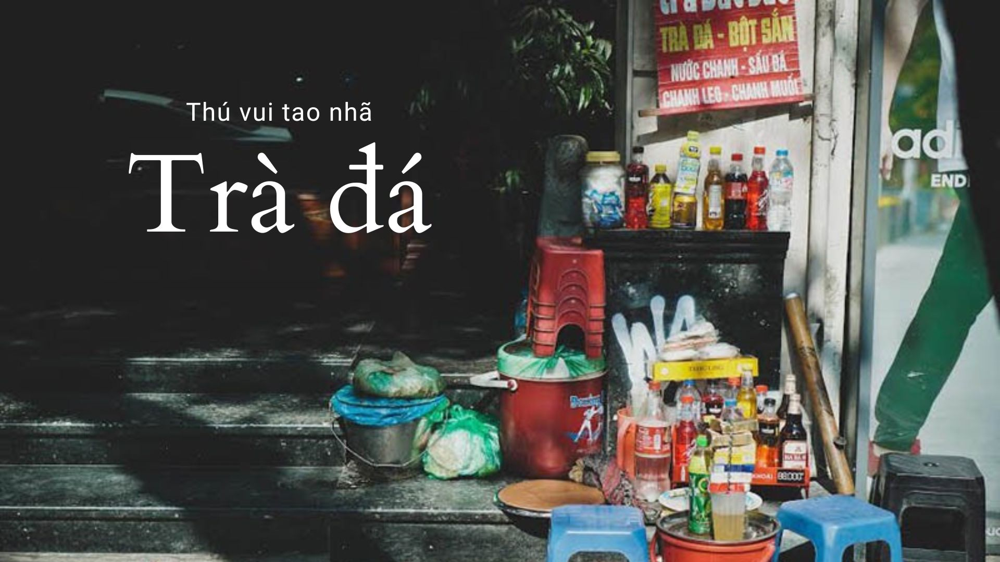

**Trà đá** là món đồ bình dân và phổ biến mà ta có thể tìm bất kì đâu ở Việt Nam. Không chỉ bởi sự tiện lợi, giá thành rẻ mà còn bởi hương vị lắng đọng của nó. Từ Bắc vào Nam, mỗi nơi đều có một hương trà khác nhau, nhưng chung quy lại nó đều mang một **giá trị văn hóa** “lắng đọng” ở mỗi người.

Trà đá được làm từ rất nhiều loại trà khác nhau, **xuất xứ** từ nhiều vùng miền. Cội nguồn của trà đá chính bắt nguồn từ miền Nam, sau đó lan ra khác vùng miền khác. Thường thì trà của nơi Sài Thành nó thanh, mát mẻ hơn. Còn đến với Hà Thành, ta nhấm nháp trong cổ họng hương vị đậm đà khó quên.

"TRA DINH"

 

## <h5 style="color:green;">TỪ VỰNG</h5>

Phổ biến - Popular - 普遍

Hương vị - Smell - 口味

Giá trị văn hoá - The cultural value - 文化价值

Xuất xứ - Origin -  来历

Đậm đà -  Rich tea flavor - 浓郁

 

<h5 style="color: red;">CÂU HỎI</h5>

Câu 1: Trà đá phổ biến ở đâu của Việt Nam?

a) Miền Bắc

b) Miền Nam

c) Cả nước

 

Câu 2: Từ " cội nguồn" ở trên có nghĩa là gì?

a) Nơi bắt đầu của thức uống "trà đá"

b) Nơi mọi người uống trà đá nhiều nhất

c) Nơi trồng trà đầu tiên của Việt Nam

 

Câu 3: Mọi người thường uống trà đá ở đâu

a) Quán trà sang trọng

b) Quán ăn truyền thống

c) Bất kỳ đâu

 

<h5 style="color:blue;">ĐÁP ÁN</h5>

Câu 1 - C, Câu 2 - A, Câu 3 - C

 

 

*Nhắn tin cho cô nếu bạn có bất cứ câu hỏi nào!*

**Course:** https://www.udemy.com/user/hoang-thi-gam-2/

**Youtube:** @VietnameseTeachers

**Contact LINE:** hoangthigam