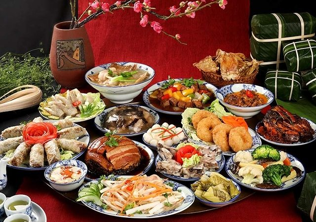

## **<h5 style="color:ORANGE;"> BÀI VIẾT</h5>**

**Tất niên** hay **cúng tất niên, lễ tất niên, tiệc tất niên** là một nghi thức nhằm ghi nhận việc kết thúc một năm và chuẩn bị bước sang năm mới. Tất niên có thể là một bữa tiệc tất niên, liên hoan cuối năm để bước sang năm mới diễn ra vào những ngày cuối năm **âm lịch**, từ ngày 30 tháng Chạp (nếu là năm đủ) hoặc 29 tháng Chạp (nếu là năm thiếu) được gọi là ngày tất niên. Đây là ngày các thành viên trong gia đình **sum họp** lại với nhau để ăn cơm buổi tất niên. Ngoài ra, tùy vào **phong tục tập quán** ở mỗi vùng, việc cúng tất niên có thể được **gia chủ** mời thêm bạn bè và người thân đến dự.

"Wikipedia"

## **<h5 style="color:BROWN;"> TỪ VỰNG</h5>**

Tất niên: Year End Party

Âm lịch: Lunar Calender - 农历

Sum họp: Gather together - 团聚

Phong tục tập quán: Customs and traditions - 风俗习惯

Gia chủ: Homeowner - 家主

## **<h5 style="color:Red;"> CÂU HỎI</h5>**

**Câu 1: Tất niên tổ chức khi nào?**

a) Cuối năm

b) Sau năm mới

c) Gia đình cùng ăn cơm

**Câu 2: Từ "sum họp" đồng nghĩa với từ nào?**

a) Bữa tiệc

b) Đoàn tụ

c) Tất niên

**Câu 3: Vào ngày tất niên, mọi người sẽ làm gì?**

a) Gia đình cùng nhau đi chơi cuối năm âm lịch

b) Mọi người cùng nhau ăn cơm tất niên

c) Tất cả thành viên cùng đi thăm bạn bè, người thân

**ĐÁP ÁN**

Câu 1 - A , Câu 2 - B , Câu 3 - B

**Nhắn tin cho cô nếu bạn có bất cứ câu hỏi nào!**

**Course:** https://www.udemy.com/user/hoang-thi-gam-2/

**Youtube:** @VietnameseTeachers

***Contact LINE:** hoangthigam*