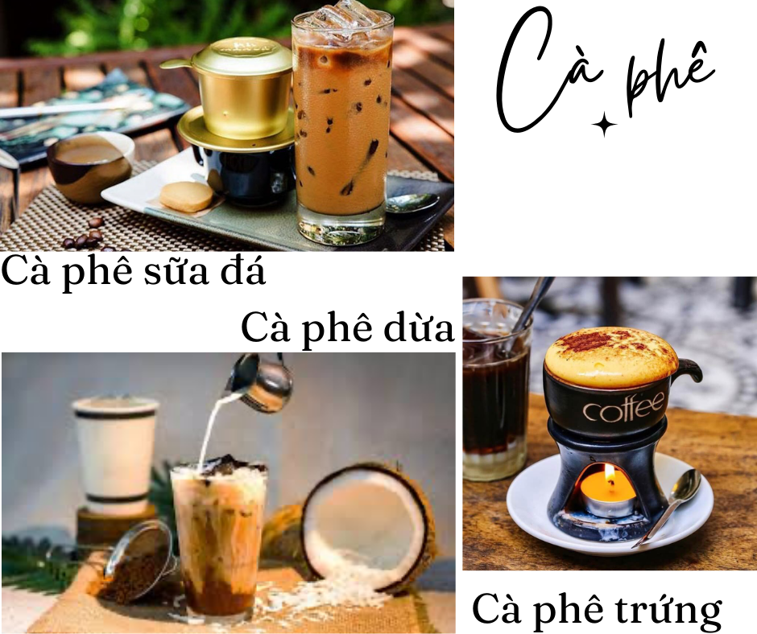

### THỨC UỐNG PHỔ BIẾN Ở VIỆT NAM

### 1. **Cà phê Việt Nam**

* #### Cà phê sữa đá
* #### Cà phê trứng
* #### Cà phê dừa

  

### 2. **Trà đá**

### 

### 3. **Nước mía**

### 

### 4. **Sinh tố - Nước ép**

### 

### 5. **Nước dừa**

### 

### 6. **Chè**

### 

### 7. **Sữa đậu nành**

### 

### 8. **Rượu gạo**

### 

### 9. **Nước sâm**

### 

### 10. **Bia hơi**

### 

### 11. **Trà tắc (trà quất)**

### 